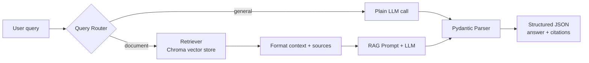

# end to end rag project
# 📚 RAG Knowledge Assistant

[](https://www.python.org/)
[](https://python.langchain.com/)
[](https://fastapi.tiangolo.com/)
[](https://streamlit.io/)
[](https://www.trychroma.com/)
[](https://render.com/)

A modular, interview-ready **Retrieval-Augmented Generation (RAG)** system where every module has a single responsibility — ingestion, retrieval, routing, generation, and the API/UI layer are all fully decoupled and independently testable.

---

## 🌟 Live Demo

- **UI:** *(https://rag-project-6xn9mdlnbrjo5gcsyzn7rd.streamlit.app/)*
- **API docs:** *( https://rag-project1-backend.onrender.com)*

---

## 🧠 How It Works



**The key idea:** before any document is retrieved, a lightweight LLM call classifies the query as `general` (skip the vector store entirely) or `document` (run full retrieval). This avoids hitting the vector store on every single request — including plain chit-chat — and keeps latency down.

---

## 🛠️ Tech Stack

| Layer | Choice |
|---|---|
| Orchestration | LangChain (LCEL) |
| Chat / Generation LLM | GPT-5.6 Luna, via the Experiential Labs OpenAI-compatible gateway |
| Embeddings | OpenAI `text-embedding-3-small` (direct) |
| Vector Store | ChromaDB (persisted locally) |
| Structured Output | Pydantic (`answer` + `citations` on every response) |
| Backend | FastAPI |
| Frontend | Streamlit |
| Evaluation | RAGAS — faithfulness, answer relevancy, context precision |

---

## 📁 Project Structure

```
rag-project/
├── data/raw/                 # source documents
├── ingestion/                 # load -> split -> embed -> persist (offline, run once)
├── retrieval/                 # wraps the persisted vector store as a retriever
├── routing/                   # classifies queries: general vs document
├── generation/                 # prompts, LLM config, structured output parser
├── backend/                   # FastAPI — POST /ask, wires everything together
├── frontend/                  # Streamlit chat UI (HTTP calls only, no LangChain)
├── evaluation/                 # RAGAS test set + scoring script
├── scripts/scaffold_project.py
├── setup.ps1                  # one-command Windows environment setup
├── requirements.txt
└── .env.example
```

---

## 🚀 Getting Started (Windows)

```powershell
git clone https://github.com/<your-username>/<your-repo>.git
cd rag-project

# One command: creates venv, installs everything, sets up .env
.\setup.ps1
```

Then:
1. Open `.env` and add your real `OPENAI_API_KEY`, `CHAT_API_KEY`, `CHAT_BASE_URL`
2. Drop source documents into `data\raw\`
3. Build the vector store:
   ```powershell
   python -m ingestion.run_ingestion
   ```
4. Run the backend (Terminal 1):
   ```powershell
   uvicorn backend.main:app --reload --port 8000
   ```
5. Run the frontend (Terminal 2, same venv activated):
   ```powershell
   streamlit run frontend\app.py
   ```

---

## 📚 API Documentation

Once the backend is running, the interactive Swagger UI is available at:
👉 `http://localhost:8000/docs`

---

## ☁️ Deployment

Deployed as two separate free-tier services, keeping the backend/frontend split real in production too:

### Backend → Render (Web Service)

| Setting | Value |
|---|---|
| Build Command | `pip install -r requirements.txt` |
| Start Command | `uvicorn backend.main:app --host 0.0.0.0 --port $PORT` |
| Environment Variables | `OPENAI_API_KEY`, `CHAT_MODEL`, `CHAT_API_KEY`, `CHAT_BASE_URL`, `EMBEDDING_MODEL`, `DATA_DIR`, `CHROMA_PERSIST_DIR`, `CHUNK_SIZE`, `CHUNK_OVERLAP` |

> The persisted vector store (`vectorstore/chroma_db/`) is committed to the repo, since Render's free tier has an ephemeral filesystem — this avoids re-embedding documents on every deploy.

### Frontend → Streamlit Community Cloud

1. New app → this repo → main file: `frontend/app.py`
2. Advanced settings → Secrets:
   ```
   BACKEND_URL = "https://<your-render-backend>.onrender.com/ask"
   ```

---

## 🔭 Possible Improvements

- Re-ranking and hybrid search (keyword + vector) for better retrieval precision
- Query rewriting for multi-turn conversations
- Guardrails / hallucination detection beyond the current prompt-level grounding
- Deeper automated evaluation (RAGAS across a larger test set)
- Containerize with Docker and add CI/CD

---

## 📄 License

MIT